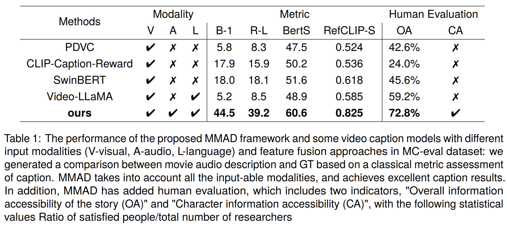

# MMAD: Multi-modal Movie Audio Description

  If you like our project, please give us a star ⭐ on GitHub for latest update.

## 📰 News

[2024.2.20] Our MMAD has been accepted at COLING 2024! Welcome to watch 👀 this repository for the latest updates.

## 😮 Highlights
MMAD exhibits remarkable AD generation capabilities in movies, by utilizing multiple modal inputs.

  

## 🎥 Demo

  

## 🚀 Main Results
Finally, we organized 10 vision health volunteers, 10 BVI people (including 3 totally blind and 7 partially sighted) for human evaluation via Likert scale, and we merged the statistical results into the result table of the paper.

  

## 🛠️ Requirements and Installation