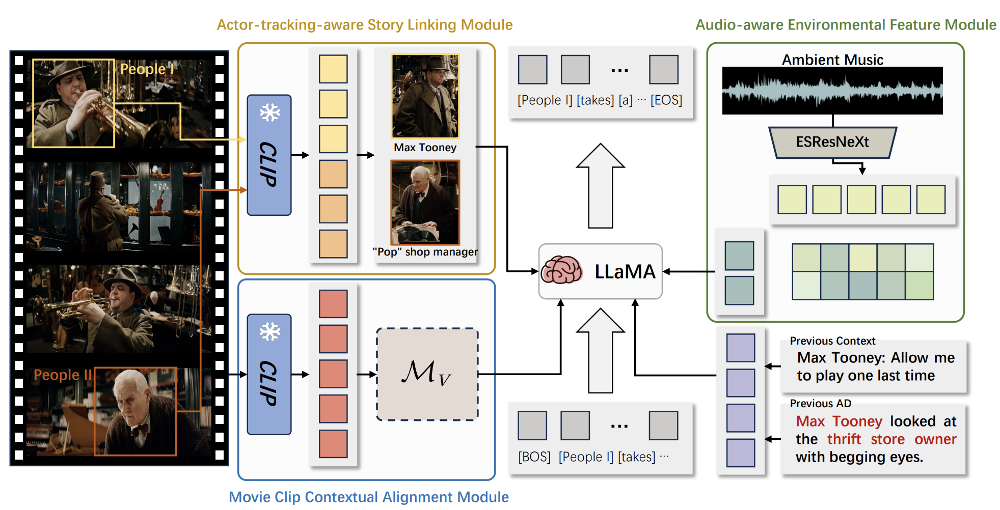
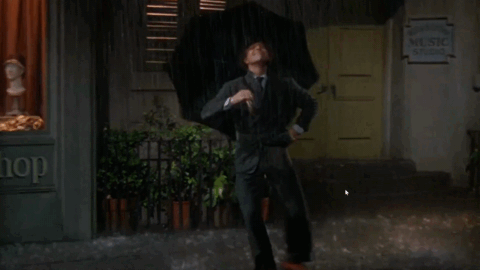
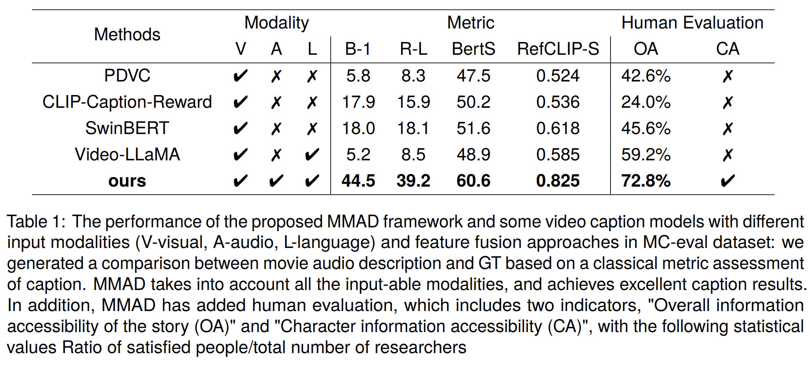

# MMAD: Multi-modal Movie Audio Description
<div align="center">
  If you like our project, please give us a star ⭐ on GitHub for latest update.
</div>

[\[📜Paper\]](https://aclanthology.org/2024.lrec-main.998/)
[\[🗂️Project Page\]](https://daria8976.github.io/mmad-page/)

## 📰 News

[2024.2.20] Our MMAD has been accepted at COLING 2024! Welcome to watch 👀 this repository for the latest updates.

## 😮 Highlights
MMAD exhibits remarkable AD generation capabilities in movies, by utilizing multiple modal inputs.

<div align="center">
  
</div>

## 🎥 Demo
<table>
 <tr>
  <td align="center" valign="center"></td><td align="center"></td>
 </tr>
 <tr>
  <td align="center">The talented pianist, 1900, mesmerized the audience with his virtuosic performance of "Christmas Eve" while wearing a pristine white tuxedo and bow tie.</td><td align="center">Chris Gardner, a man with a box in his hand, runs frantically through the city, dodging people and cars while being chased by a taxi driver who is honking.</td>
 </tr>
 <tr>
  <td align="center"></td><td align="center"></td>
 </tr>
 <tr>
  <td align="center">Dancing in the rain, Don Lockwood twirls with joy, umbrella in hand, amidst city streets.</td><td align="center">Alice fled through the mushroom forest, her heart racing as the Bandersnatch's ominous hisses and growls echoed behind her.</td>
 </tr>
</table>

## 🛠️ Installation
1. You are required to install the dependencies. If you have conda installed, you can run the following:
```bash
git clone https://github.com/Daria8976/MMAD.git
cd MMAD
bash environment.sh
```
2. Download weights from [pretrained model](https://huggingface.co/Daria8976/MMAD_pretrained_model/tree/main/pretrained_model):

* **checkpoint_step_50000.pth** under ```checkpoint``` folder
* **base.pth** under ```AudioEnhancing/configs``` folder
* **[LanguageBind/Video-LLaVA-7B](https://huggingface.co/LanguageBind/Video-LLaVA-7B/tree/main)** under ```VideoCaption``` folder
3. prepare **REPLICATE_API_TOKEN** in ```llama.py```

4. Prepare demo data (We provide four demo video [here](https://huggingface.co/Daria8976/MMAD_pretrained_model/tree/main/demo_video)):
* put **demo.mp4** under ```Example/Video```
* put **[character photo]** (Photos should be named with the corresponding character name) under ```Example/ActorCandidate```

## 💡 Inference

```bash
python infer.py
```

## 🚀 Main Results
Finally, we organized 10 vision health volunteers, 10 BVI people (including 3 totally blind and 7 partially sighted) for human evaluation via Likert scale, and we merged the statistical results into the result table of the paper.
<div align="center">
  
</div>

## 📜 Cite
```
@inproceedings{ye2024mmad,
  title={MMAD: Multi-modal Movie Audio Description},
  author={Ye, Xiaojun and Chen, Junhao and Li, Xiang and Xin, Haidong and Li, Chao and Zhou, Sheng and Bu, Jiajun},
  booktitle={Proceedings of the 2024 Joint International Conference on Computational Linguistics, Language Resources and Evaluation (LREC-COLING 2024)},
  pages={11415--11428},
  year={2024}
}
```

## Acknowledgements
Here are some great resources we benefit or utilize from:
* [Video-LLaVA](https://github.com/PKU-YuanGroup/Video-LLaVA) and [Pengi](https://github.com/microsoft/Pengi) for Our code base.
