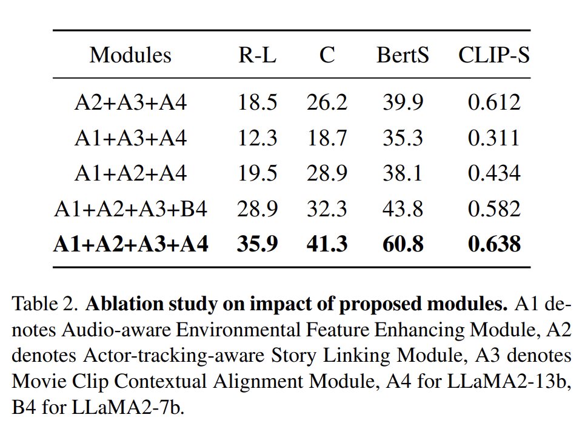
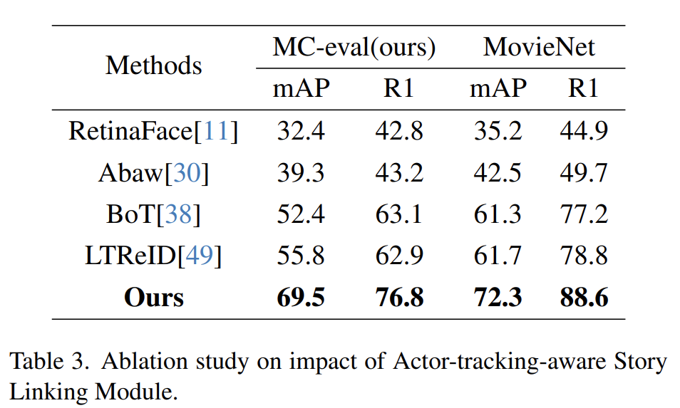
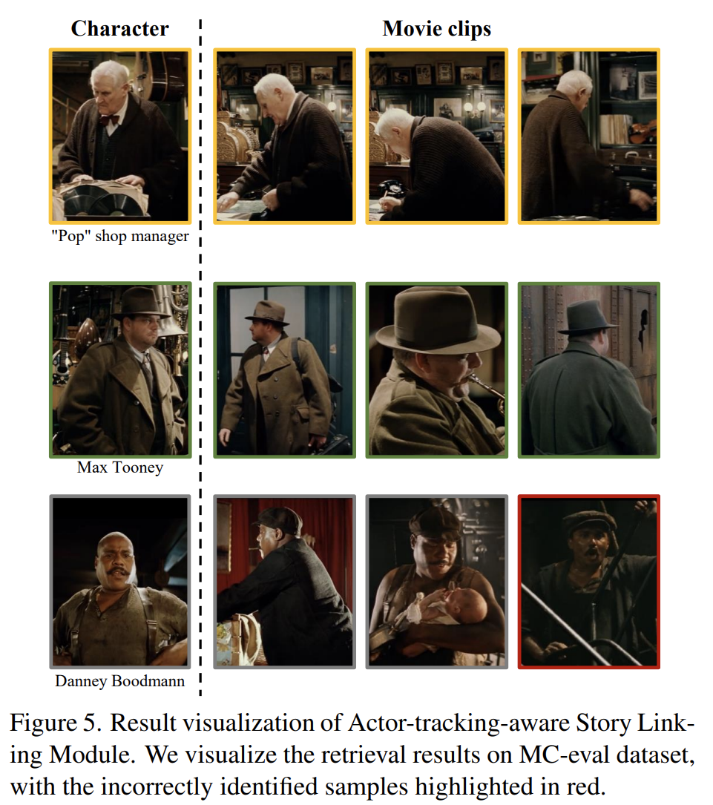
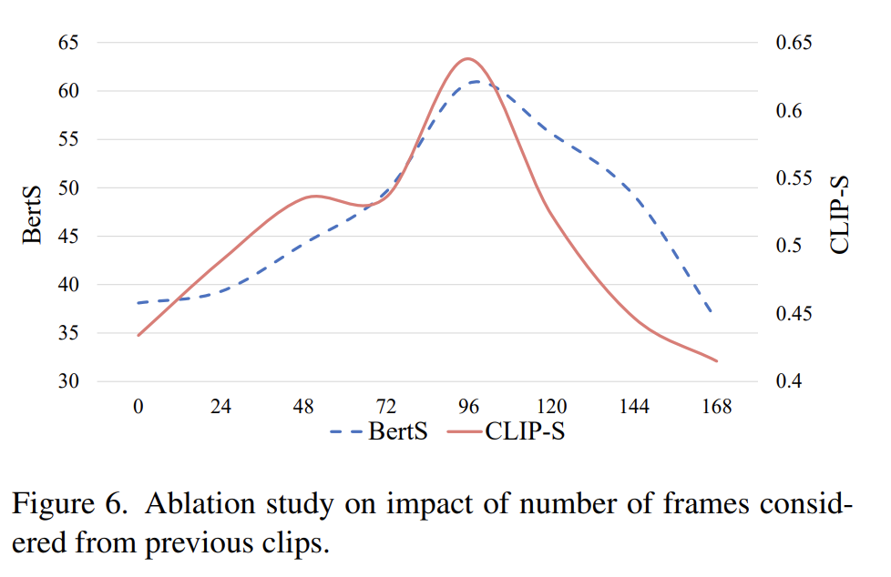

# MMAD: Multi-modal Movie Audio Description
## Related Work
**Multimodal video subtitles.** The ADLAB PRO guide's survey results on the needs of visually impaired groups in various countries for AD point out that AD requires accurately convey the plot and details of movies or other cultural events. Drawing inspiration from dense image captioning paradigms(Johnson et al., 2016), Krishna and team pioneered the dense video captioning arena, underpinned by the ActivityNet Captions dataset(Krishna et al., 2017; Zhou et al., 2018; Mun et al., 2019; Rahman et al., 2019). Vladimir & Esa's MDVC approach(Iashin and Rahtu, 2020) proffered an amalgamation of modalities, underscoring that audio-visual synergy enhances video caption quality. Video subtitles are responsible for obtaining important elements, relative relationships and action behaviors in video key frames, which constitute the main part of the movie audio description. 

In addition to the video module, a good AD needs to provide as much information as possible for description optimization. The inaugural venture into audio captioning surfaced in (Drossos et al., 2017), utilizing PSE's auditory datasets and harnessing BiGRU(Rana, 2016)-centric models. Subsequently , endeavors like those by (Xu et al., 2021) dissected audio subtitle semantics within a comprehensive framework, marking SOTA milestones by adeptly weaving in diverse informational threads via transfer learning. Apart from improvements in the modal input part, the emergence of large language models has brought huge improvements to AD quality compared to previous models. Inspired by VisionLLM(Wang et al., 2023) and AnyMAL(Moon et al., 2023), the MMAD proposed in this paper maps multi-modal features into a language-aligned feature space, and uses LLama(Touvron et al.) decoding to obtain the final AD.

**Video subtitles for BVI.** Unlike traditional video subtitles, accessibility-oriented video subtitles need to meet the specific needs of visually impaired viewers. This type of accessible audiovisual media working model is expected to comply with accessibility regulations and meet the needs of the visually impaired community for audio description. Furthermore, compared with the independent and separated video caption model, movie audio description needs to maintain the memory of the previous content for maintaining the smoothness of the narrative. 

Wang et al.(Wang et al., 2021) proposed an end-to-end system for automatic audio description generation.The system utilizes an attention-based video dense caption generation model to generate descriptions for all events in each inconsistent video clip. However, the challenge of creating contextually rich and timely descriptions remained. Vander Wilt and Farbood(Vander Wilt and Farbood, 2021) tackled live theater accessibility, proposing an online time warping algorithm for aligning prerecorded audio descriptions. Their approach was innovative but faced challenges in handling the dynamic nature of live performances. To further this work, Rocha Filho et al.(Filho et al., 2021) introduced a system for automatic character description in videos, employing deep learning techniques. However, the challenge of seamlessly integrating these descriptions into the video narrative persisted. Finally, Campos et al.(Campos et al., 2023) explored CineAD, a system for audio description using movie scripts and visual information. Despite its potential, it struggled with synchronizing descriptions with live video content. 

Previous researchers mainly focused on accessible video subtitles and lacked contextual information integration modules suitable for movie-level audio description. Therefore, we designed the Movie Clip Contextual Alignment Module to provide more contextual information in movie audio description. In addition, No previous work has applied multimodal techniques to movie descriptions, so previous audio descriptions generated by automated systems tended to be single descriptions that lacked emotional coloring. This article proposes the Audio-aware Environmental Feature Enhancing Module, which uses LLM to generate richer and smoother audio descriptions in a multi-modal manner. Most importantly, previous work lacked a suitable character recognition module. The Actor-tracking-aware Story Linking Module proposed in this paper is suitable for character recognition in movie scenes where faces are often missing, it helps the visually impaired group better understand the plot of the movie.

## Overview

  

## Experiment
We organized 25 visually impaired groups to conduct the human evaluation of MMAD, and we used a five-point Likert Scale to count the satisfaction of the 25 visually impaired groups with the movie audio descriptions generated by MMAD, and we merged the statistical results into the result table of the paper.

  

## Ablation Study
### Effect of the proposed modules.
In this part, we first study the influence of each proposed module and the employed LLM on the final Movie Audio Description (MAD) performance. We separately remove each module from our design and evaluate the resulting MAD on the MC-eval dataset (Tab. 2). The results show that removing the Audio-aware Environmental Feature Enhancing Module has minimal impact on the CLIP-S metrics, which primarily assess the correlation between movie frame visuals and text. However, removing the Actor-tracking-aware Story Linking and Movie Clip Contextual Alignment Modules, both crucial for visual information acquisition, significantly decreases the CLIP-S metrics and enlarges the gap between model-generated captions and the Ground Truth (GT). Furthermore, the LLM size significantly influences the MAD quality, with the 13b model of LLaMA2 yielding more human-like captions than the 7b model, underscoring model complexity's impact.

  

### Effect of  Actor-tracking-aware Story Linking Module.
The effectiveness of our Actor-tracking-aware Story Linking Module hinges greatly on the precision of character recognition. To evaluate this, we compare our proposed method with two face detection algorithms and three Re-Identification (ReID) algorithms, widely used for accurately identifying main characters in movie datasets. The results are shown Tab. 3 Comparing our approach with these five existing methods, our character recognition technique proves to significantly enhance the performance. Fig. 5 illustrates some examples of our recognition results.

  

  

### Effect of Movie Clip Contextual Alignment Module.
The Movie Clip Contextual Alignment Module plays a pivotal role in our design, as it integrates visual information from preceding dialog-rich clips into the caption generation process for the current clip. To understand the influence of this module, we explore the qualitative relationship between the quality of the generated descriptions and the number of frames considered from previous clips involving character dialogue.  In this context, the quality of the Movie Audio Description is primarily evaluated using BertS and CLIP-S metrics. The relationship between the number of prior frames considered and the resulting description quality, as measured by these metrics, is depicted in Fig. 6. We observe that as the number of prior subtitle-inclusive clips considered increases, the resulting movie audio description becomes more extensive. However, given the necessity to fit the narration within a specific time frame, a balance must be struck. When more than 96 frames are considered, the captions must be controlled for word count, leading to a more concise description. Consequently, this streamlining may result in a compromise in description quality.

  

